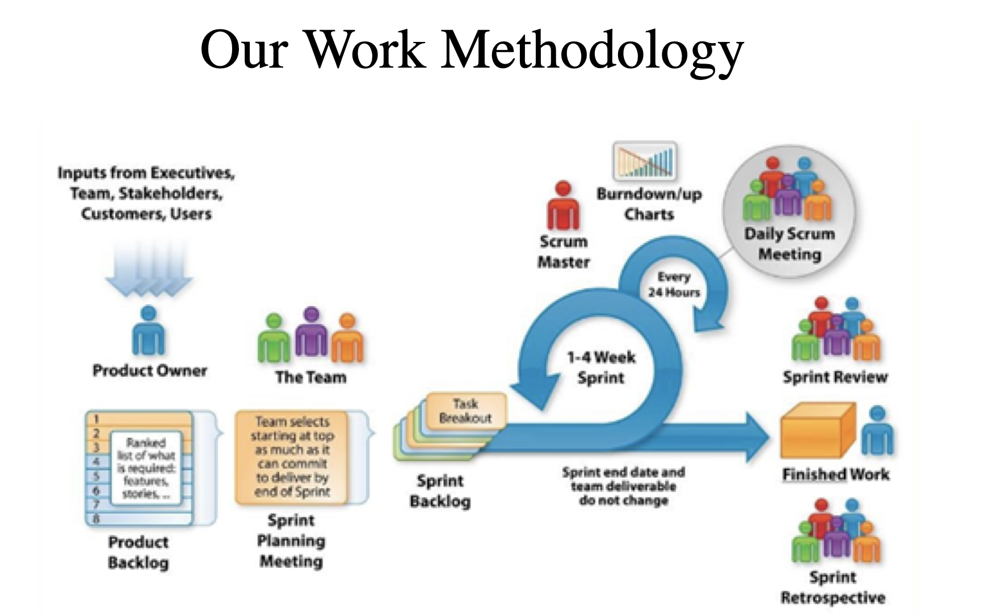

# Sapient Freshers-2021-jun-asde

Batch POC: Kanhav Ghai 
*** 

Aarsh Verdan - DTU, Joined in pJP, likes to play online games, guitar, and likes to learn technology 

Akhil tomar - DTU, likes : Backing Trecking, Travelling 

Akshit Kumar - IIT Karagpur, playing video games, graphic designing, PS, 

Aneesha Kota - IIT bhubaneshwar, play badminton, sports, singing 

Bitan - IIT Bhubanesh, sudoku, likes reading a lot, watching web series one 

Deepanjan  - IIT Patna, CS, like to sing, swimming 

Harshit singal - IIT Delhi, part of PJP, optimistic, likes to play soccer, and like playing chess 

Hemanth Umanshanar - NIT Suratkat, plygin video games, watigin movies, playing guitar 

Kanav Ghai - IIT Patna, likes youtube with sports, and likes eating 

Karmanya Sharma - likes to learn, play football, badminton, started blogging, 

Krishna - IIT Bhubaneshwar, CS, watching cricket, likes cooking 

Lakshya - IIT Gandhinagar, CS, playing badminton,  likes listening to music, 

Prateek - IIT Kharagpur, watining movies, does cooking 

Priyadarshan - DTU, CS, likes to play guitar, likes to play with dog, reads blogs 

Raj Shekar - does painting, drawing , and likes to watch TV Series 

Rizwan Khan - from Delhi, IIT Patna, playing cricket 

Rohit - IIT Gandhinagar, ply online games, cricket watch TV Series, 

Sailaja - IIT bhubaneshwar, plays badminton, mobile games 

sanjana - NITK surajkal, digital art work, 

Shushrut - NITK suratkal, CS, motor sport 

Sioddharth - IIT Roorkey, plays any sports, watch movies, TV series, etc 

pradyuman - IIT patna, plays chess, watch movies, in free time 

Suhas - IIT suratkal, PC games, watch F1, football

Veena - NITK suratkal, playing basket ball, likes eating street food. 


***


# DAY 1 
CONFLUENCE(Wiki) - JIRA - BITBUCKET 

Git +  GitHub / BitBucket  
Jenkins (CI/CD)

LEFT -> RIGHT ( collges, they teach technologys then solve the problem)
RIGHT -> LEFT (first identify the problem then the technology comes)


Work Approach
1. Tech stack 
2. 4-5 Week of training - in that we have a small project 
3. 7 Weeks a full fledged project work 
   
TDD Style - Technology 
BDD Style - Semi Technology
     GIVEN, WHEN, THEN (AND, BUT)
DDD Style - Pure Business 

DOR - Defination of Release  
DOD - Defination of Done 


## _Working Method_




List Of Softwares : 

* Git Bash : https://git-scm.com/downloads
* Java 8 : https://www.oracle.com/in/java/technologies/javase/javase-jdk8-downloads.html
* Jenkins : https://www.jenkins.io/download/
* Docker : https://docs.docker.com/docker-for-windows/install/
    
    > docker run hello-world 

* Eclipse : https://www.eclipse.org/downloads/
* VS Code : https://code.visualstudio.com/download
* NodeJS : https://nodejs.org/en/


Either go with "master", "main" 

### Git Commands 
> git init 

> git branch <branchName> -- create a branch 

> git checkout <branchName> - checkout / switch branch 

> git branch --merged  - to show if the current branch is merged from other branch 

> git branch --no-merged - to show if the current branch is not merged from other branch 

> git checkout main 

> git merge new_branch 

> git checkout -b dev1  (create and switch the branch)

### Git Reset 
* soft reset - will keep the file in stagin area but not commit 
* mixed reset (defult) - this will take the file to untracked area 
* hard reset - the content is also take off 

In any case if you want to get back your code, have the commit id and you can checkout from there 

> The git reset command is a complex and versatile tool for undoing changes. It has three primary forms of invocation. These forms correspond to command line arguments --soft, --mixed, --hard. 

> git stash temporarily shelves (or stashes) changes you've made to your working copy so you can work on something else, and then come back and re-apply them later on.


In Git we have 4 area 
1. Untracked files 
2. Tracked (add)
3. committed files (commit)
4. stash

### working with stash
> git stash save "message"

> git stash list 

> git stash pop - it applied and removes

> git stash apply stash@{<NUMBER>} - applies and doesnot remove 

> git stash drop stash@{<NUMBER>} - to remove the stash 

> git stash clear - to clear all the stash 

> git stash show stash@{<NUMBER>} - to show the stash 

> git shash show -p  stash@{<NUMBER>} - to show the actual code 

> git fetch + git merge = git pull 

to delete the branch on remote 
> git push origin --delete branch_name

> git push origin :branch_name


### Branching Stratergy 


# Jenkins 

1. Freestyle project 
   1. scripted fashion (.sh / .bat)
2. Pipe line project * 
   1. you can have groovy code  in Jenkins 
   2. You can have groovy code in "Jenkinsfile" on remote SCM 


```
pipeline {
    agent any

    stages {
        stage('Hello') {
            steps {
                echo 'Hello World'
            }
        }
        
    }
}

```


```
    pipeline {
    agent any

    tools {
        // Install the Maven version configured as "M3" and add it to the path.
        maven "M3"
    }

    stages {
        stage('Build') {
            steps {
                // Get some code from a GitHub repository
                git 'https://github.com/jglick/simple-maven-project-with-tests.git'

                // Run Maven on a Unix agent.
                sh "mvn -Dmaven.test.failure.ignore=true clean package"

                // To run Maven on a Windows agent, use
                // bat "mvn -Dmaven.test.failure.ignore=true clean package"
            }

            post {
                // If Maven was able to run the tests, even if some of the test
                // failed, record the test results and archive the jar file.
                success {
                    junit '**/target/surefire-reports/TEST-*.xml'
                    archiveArtifacts 'target/*.jar'
                }
            }
        }
    }
}

```


### Create Maven Project 

mvn archetype:generate -DgroupId=com.mycompany.app -DartifactId=my-app -DarchetypeArtifactId=maven-archetype-quickstart -DarchetypeVersion=1.4 -DinteractiveMode=false


to show if 1 stage fails other will not execute 