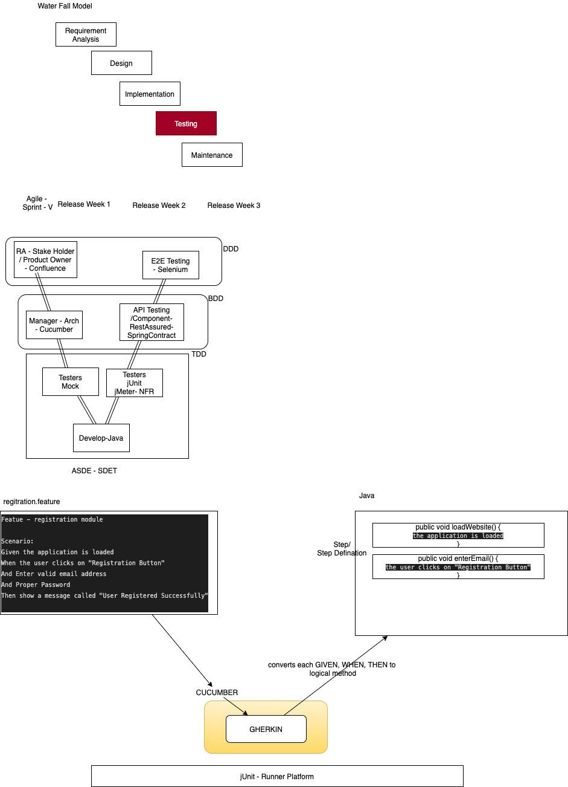
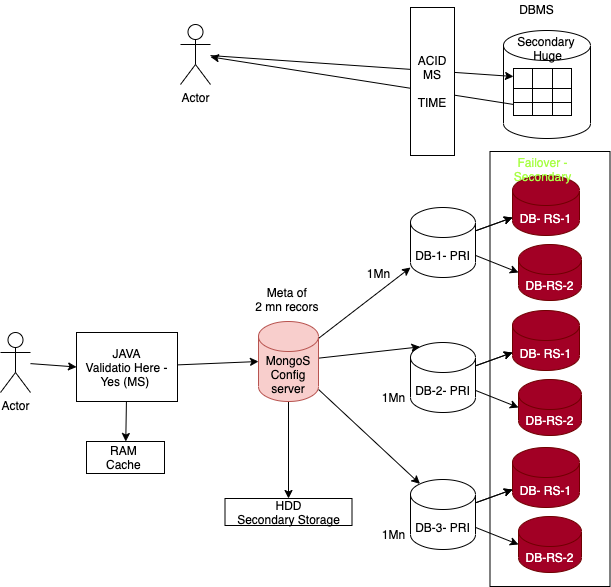
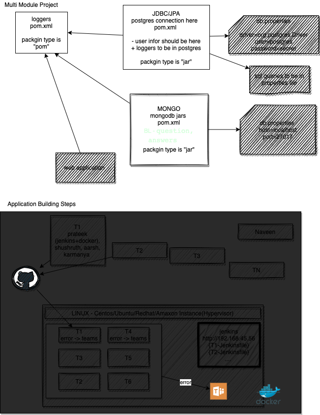

# Sapient Freshers-2021-jun-asde

Batch POC: Kanhav Ghai 
*** 

Aarsh Verdan - DTU, Joined in pJP, likes to play online games, guitar, and likes to learn technology 

Akhil tomar - DTU, likes : Backing Trecking, Travelling 

Akshit Kumar - IIT Karagpur, playing video games, graphic designing, PS, 

Aneesha Kota - IIT bhubaneshwar, play badminton, sports, singing 

Bitan - IIT Bhubanesh, sudoku, likes reading a lot, watching web series one 

Deepanjan  - IIT Patna, CS, like to sing, swimming 

Harshit singal - IIT Delhi, part of PJP, optimistic, likes to play soccer, and like playing chess 

Hemanth Umanshanar - NIT Suratkat, plygin video games, watigin movies, playing guitar 

Kanav Ghai - IIT Patna, likes youtube with sports, and likes eating 

Karmanya Sharma - likes to learn, play football, badminton, started blogging, 

Krishna - IIT Bhubaneshwar, CS, watching cricket, likes cooking 

Lakshya - IIT Gandhinagar, CS, playing badminton,  likes listening to music, 

Prateek - IIT Kharagpur, watining movies, does cooking 

Priyadarshan - DTU, CS, likes to play guitar, likes to play with dog, reads blogs 

Raj Shekar - does painting, drawing , and likes to watch TV Series 

Rizwan Khan - from Delhi, IIT Patna, playing cricket 

Rohit - IIT Gandhinagar, ply online games, cricket watch TV Series, 

Sailaja - IIT bhubaneshwar, plays badminton, mobile games 

sanjana - NITK surajkal, digital art work, 

Shushrut - NITK suratkal, CS, motor sport 

Sioddharth - IIT Roorkey, plays any sports, watch movies, TV series, etc 

pradyuman - IIT patna, plays chess, watch movies, in free time 

Suhas - IIT suratkal, PC games, watch F1, football

Veena - NITK suratkal, playing basket ball, likes eating street food. 


***


# DAY 1 
CONFLUENCE(Wiki) - JIRA - BITBUCKET 

Git +  GitHub / BitBucket  
Jenkins (CI/CD)

LEFT -> RIGHT ( collges, they teach technologys then solve the problem)
RIGHT -> LEFT (first identify the problem then the technology comes)


Work Approach
1. Tech stack 
2. 4-5 Week of training - in that we have a small project 
3. 7 Weeks a full fledged project work 
   
TDD Style - Technology 
BDD Style - Semi Technology
     GIVEN, WHEN, THEN (AND, BUT)
DDD Style - Pure Business 

DOR - Defination of Release  
DOD - Defination of Done 


## _Working Method_


List Of Softwares : 

* Git Bash : https://git-scm.com/downloads
* Java 8 : https://www.oracle.com/in/java/technologies/javase/javase-jdk8-downloads.html
* Jenkins : https://www.jenkins.io/download/
* Docker : https://docs.docker.com/docker-for-windows/install/
    
    > docker run hello-world 

* Eclipse : https://www.eclipse.org/downloads/
* VS Code : https://code.visualstudio.com/download
* NodeJS : https://nodejs.org/en/


Either go with "master", "main" 

### Git Commands 
> git init 

> git branch <branchName> -- create a branch 

> git checkout <branchName> - checkout / switch branch 

> git branch --merged  - to show if the current branch is merged from other branch 

> git branch --no-merged - to show if the current branch is not merged from other branch 

> git checkout main 

> git merge new_branch 

> git checkout -b dev1  (create and switch the branch)

### Git Reset 
* soft reset - will keep the file in stagin area but not commit 
* mixed reset (defult) - this will take the file to untracked area 
* hard reset - the content is also take off 

In any case if you want to get back your code, have the commit id and you can checkout from there 

> The git reset command is a complex and versatile tool for undoing changes. It has three primary forms of invocation. These forms correspond to command line arguments --soft, --mixed, --hard. 

> git stash temporarily shelves (or stashes) changes you've made to your working copy so you can work on something else, and then come back and re-apply them later on.


In Git we have 4 area 
1. Untracked files 
2. Tracked (add)
3. committed files (commit)
4. stash

### working with stash
> git stash save "message"

> git stash list 

> git stash pop - it applied and removes

> git stash apply stash@{<NUMBER>} - applies and doesnot remove 

> git stash drop stash@{<NUMBER>} - to remove the stash 

> git stash clear - to clear all the stash 

> git stash show stash@{<NUMBER>} - to show the stash 

> git shash show -p  stash@{<NUMBER>} - to show the actual code 

> git fetch + git merge = git pull 

to delete the branch on remote 
> git push origin --delete branch_name

> git push origin :branch_name


### Branching Stratergy 


# Jenkins 

1. Freestyle project 
   1. scripted fashion (.sh / .bat)
2. Pipe line project * 
   1. you can have groovy code  in Jenkins 
   2. You can have groovy code in "Jenkinsfile" on remote SCM 


```
pipeline {
    agent any

    stages {
        stage('Hello') {
            steps {
                echo 'Hello World'
            }
        }
        
    }
}

```


```
    pipeline {
    agent any

    tools {
        // Install the Maven version configured as "M3" and add it to the path.
        maven "M3"
    }

    stages {
        stage('Build') {
            steps {
                // Get some code from a GitHub repository
                git 'https://github.com/jglick/simple-maven-project-with-tests.git'

                // Run Maven on a Unix agent.
                sh "mvn -Dmaven.test.failure.ignore=true clean package"

                // To run Maven on a Windows agent, use
                // bat "mvn -Dmaven.test.failure.ignore=true clean package"
            }

            post {
                // If Maven was able to run the tests, even if some of the test
                // failed, record the test results and archive the jar file.
                success {
                    junit '**/target/surefire-reports/TEST-*.xml'
                    archiveArtifacts 'target/*.jar'
                }
            }
        }
    }
}

```


### Create Maven Project 

> mvn archetype:generate -DgroupId=com.mycompany.app -DartifactId=my-app -DarchetypeArtifactId=maven-archetype-quickstart -DarchetypeVersion=1.4 -DinteractiveMode=false


****


# DAY 2 

Run with PR from Master -> Dev -> branches 


1. Maven 

Maven has 3 Stages 
* clean (clean)
* work (various stages like compile, deploy, install, provided etc)
* report (site) - this will help you to generate the report 


> mvn compile

> mvn clean compile

> mvn package

> mvn clean package

> mvn test

> mvn clean test

> mvn site – to generate documentation

> mvn clean

> mvn eclipse:eclipse – compatible to eclipse

*** 
simple to program to show usage of slf4j 


1. Docker

> Tightly Couples Loosely Cohisive -> Highly Cohisive Loosely Coupled systems 

Docker allows tha orchestration with 
* Docker Swarm 
* Rancher 
* ECS 
* Kubernetees 
  
*** 
## Docker Introduction Commands 

> docker info 

> docker images - will get all the images which are in current system 

> docker pull image-name - will search for the image in hub.docker.com 

> docker ps - active containers which are running 

> docker ps -a [ - active containers which are running  + which are stopped]

> docker rm container-id [to remove the container which is stopped]

> docker rmi imageif [ to remove the images]

> docker system prune [ to remove images which are not in use ]

> docker stop container-id [to stop the container which is running ]

> docker start container-id [to start the container ]
Note: you cannot delete running container to do so first stop / force delete 

> docker pull mongo 

> docker run -name sapient-mongodb1 -d mongo 

to get into the mongo instance 

> docker exec -it [ containerid/name ] sh 

**to push image to hub.docker.com**

> Syntax: docker push username/imageid:tag
> Example: docker push adithnaveen/java-image:1

### _Hosting Jenkins With Docker_

> docker pull jenkins 

> docker run --name sapient-jenkins-instance -d -p 8080:8080 -p  50000:50000  jenkins:2.7.4

> docker logs [ container-id ] - to get the logs of the running container 

> docker inspect [container -id ] - to get the details of the container 

> docker history i-hello-world-3


To deploy a java application 

Steps 
```
    1. docker pull openjdk 
    2. mvn clean install 
    3. copy jar file to docker container 
    4. java -cp target/app-snapshot.jar com.mycompany.app.App
```

_**Docker can build images automatically by reading the instructions from a Dockerfile**_

to build image 
> docker image build -t i-hello-world-4 .


to run 
>  docker run i-hello-world-5:latest


Assignment Image 

To build a pipe line for using jenkins / docker 


## Docker Volumes 

> docker volume ls 

> docker volume create vol-name

> docker volume inspect vol-name 

start jenkins instance attached to volume(default)

> docker run --name jenkins-container-1 -v [ vol-name ]:/var/jenkins_home -p 8080:8080 jenkins:2.7.4 

start jenkins instance attached to volume - bind a folder 

> docker run --name jenkins-container-1 -v /users/naveenkumar/Desktop/folder-name:/var/jenkins_home -p 9000:8080 jenkins:2.7.4 

*** 


> Team 1 - Prateek, rajshekar, akshit, harshit

> Team 2 - Deepanjan, kanav, rizwan, praduman 

> Team 3 - karmanya, priyadarshan, aarsh verdhan, akhil 

> Team 4 - krishna, aneesha, bitan, sailaja 

> Team 5 - rohit, laksay, shushut, siddharth 

> Team 6 - sanjana, suhas, hemanth, veena 


****

# DAY 3 

****

- WORM (Write Once Read Many)

* Docker Volumes 
* install sonar lint + object aid 
* understand java program 

```
    int main() {} - you have control 
    void main() {} - 0 
```


_HelloWorld.java_
```
package com.naveen; 

    public class HelloWorld {
        static void hi()  {}
        void bye()  {}
        int x=100; - heap  
        static int yy=100;
        boolean flag = true; 
        public static void main(String [] args) {
            int y; 
            HelloWorld h = new HelloWorld();
            h.bye();
            hi();
            System.out.println(h.x);
            System.out.println("hi);
        }
    }


```
> javac -d . HelloWorld.java  - syntax and semantic .class - compiler / JITC
> java com.naveen.HelloWorld hi[0] bye[1] cya[2] - interpreter 


### Diagram 


_stack calls_

```
version 1 
int main(){
    hi();
}

hi(){
    bye()
}
bye() {
    cya()
}
cya(){}    

```


```
version 1 
int main(){
    hi();
}

hi(){
    ....
}
```


String can hold - "10" , "true", .png 
.exe - mac / lin (does not work)
.so / a.out - win / max (does not work)
.dmg - win / lin 

> access specifiers 
1. public 
2. private 
3. protected 
4. default(package)


***
Folder Structure 
Training (Repo)
    aneesha-llid
        w1-d1-git-jenkins
        w1-d2-maven-docker
        w1-d3-java
        w1-d4-java-dp

    bitan-llid
    Participant 3
    ..
    Participant n
***


- Differnt UML diagrams (26) types of diagram 
  - class diagram 
  - use case diagram 
  - activity diagram 
  - sequence 
  - profile diagram 
  - flow chart 
  - data flow diagram 
  - component diagram 
  - objecet diagram 
  - state diagram 
  - context diagram 

* HLD - High Level Diagram 
  * use case diagram 
  * flow chart 
  * component diagram
  * context diagram 


* LLD - Low Level Diagram 
  * class diagram 
  * use case diagram 
  * flow chart 


plantuml (explore)
abstract class  "abstract class"
annotation      annotation
circle          circle
()              circle_short_form
class           class
diamond         diamond
<>              diamond_short_form
entity          entity
enum            enum
interface       interface


OOPS - anti pattern  
* compositon - has-a
  
  ```
    class Employee {
        private int empId; 
        private Name name;
        private double salary; 

    // getters / setters 
    }

    class Customer {
        private Name name; 
        private int custId;
        private double income; 
    }
    class Trainer {
        private int tId; 
        private Name name; 
        private double level;

    }

    class Name {
        private String firstName; 
        private String middleName; 
        private String lastName; 
    }


  ```


* aggregation 
* association -is-a (generalization - speciliazation)
  ```
    class Vehicle {} - generic class 
    class Car extends Vehicle {}  generic class  - specific class 
    class Maruti extends Car {} - specific class 
  ```


* S - Single-responsibility principle
* O - open close - should be open for extension, but closed for modification
* L - Functions that use pointers or references to base classes must
             be able to use objects of derived classes without knowing it

```
    
    interface Vehilcle {
        public void move();
    }
    class Car extends Vehicle {
        public void driveStreering() {}
         public void move(){} 
    }
    class TwoWheeler extends Vehilce {
        public void handle(){}
         public void move(){} 
    }

    class VehilcleBL {
      

        public static void show(Vehicle v) {
            v.move();
            if(v instanceof Car) {
                v.driveSteering();
            }else if(v instanceof TwoWheeler) {
                v.handle()
            }
        }

    }

    class App {
        public static void main(String [] args) {
            Vehicle v; 
            v = getMe("car");
            VehicleBL.show(v);        

            v = new getMe("twoWheeler");
           VehicleBL.show(v); 
        }
    }

```


in C 
```
    int main() {
        int *p; 
        p  = (int *) malloc(100); 
        ... your business logic 

        free(p); 
    }
```

* I -  Interface segregation principle: 
    "Many client-specific interfaces are better than one general-purpose interface" 
* D - Dependency Injection (DI)/ IOC 


*** 
* KISS 
* DRY 
* YAGNI 


### Vehicle management system 
Below are the asks 

* The company (XYZ) who manufacures chasis / nuts/ enginee etc 
* they have a problem to integrate various cars which they are catering 
* the want a unifed system where can build "nut/bolt" for differnet cars / two / trucks 
*  the code is exposed to the client but they have comeback saying its complicated to 
  understand what is available 
  Ex:  class Vehicle {} 
  class Car extends Vehicle{}
  class Maruti extends Car {}
  
    class Breeza extends Maruti {}
    class Swift extends Maruti{}
  
  class BMW extends Car {}
    class X1 extends BMW {}
    class X2 extends BMW {}

  class Volve extends Car{}
    class VSixty extends Volvo {}

X1 x1  = new X1(); 
x1.showNutBolt() (wrong)

* they want a common interface where they can see size / dimention / weight of nut/ bolts 
* they would like to have the data kept in matrix format 
  * maruti -> Breeza / Swift ...
  * BMW -> X1, X2...
  * Volvo - VSixty, CSixty ...
```
> way 1
class Brands {
    private String branchName; 
    private List< Car > cars; 
}


List<Brands> brandedCars = new List<Brands>(); 
Brands marutiBrands = new Brands(); 
marutiBrands.setBrandName("Maruti"); 
marutiBrands.setCars()
brandedCars.add(List.of(new Car("Breeza", 4), new Car("Swift", 5)); 

> way 2 

HashMap<String, List<Car>> brandedCars = new HashMap<>(); 
brandedCars.put("maruti", List.of(new Breeza(), new Swift())
brandedCars.put("maruti", List.of(new Car("Breeza", 4), new Car("Swift", 5)); 

```


write 1 method which should show all the cars (nuts/bolts)


****
# DAY 4 

Convention 
> package - has to be in lower case & cannot be in default package 
    * com.company.something 
    * org.company.something 

> variable / methods - camelcase - start with lower case then every words first char is in upper chse 

  * empId, empName, debitSalary, creditSalary, getEmployeeSalaryFromDB() 
  
> class name - pascal casing 
  * start with upper case then every next work first char in upper case 
    Employee, EmployeeProcessor, EmployeeDAO, IEmployeeDAO 
> constants 
    * to be in upper case 
    * COMPANY_NAME, TAX 


class - contracting Abastract Class (only abstract, you can have concrete methods) 
    / Interface (100%, concrete methods but has to be default prefixed) 


Noun - Entity / Bean 
Employee - DB 

EmployeeDAO 


> access-specifer access-modifier returntype methodname(param)

>access-specifer  - public, private, protected, default 
> access-modifier - static, final, sychronized, abstract 
> void or type (int, flotat, Employee, Vehicle) 


```
    class Company {}
    @Data 
    class Employee {
        private Company company; 
        private int empId; 
        private String name;

        public void setCompany(Company company) {
            this.company = company; 
        }
    }

// BLR 
    Company company = Company.getInstance();

    Employee e = new Employee(); 
    e.setCompany(company); 
    e.blah() 

// CHN
 Company company = Company.getInstance();

    Employee e = new Employee(); 
    e.setCompany(company); 
    e.blah() 


    Vehicle
        Car 
            BMW 
                X1
                X2
                X3
                X4
                ..
            Maruti  
                Swift 
                Kizashi
                Scross.. 
        TwoWheeler 
    Color 
        BLUE
        GREEN
        BLACK
        WHITE

```


chain of rsponsitibliy 

```
    fetch(url)
        .then()
        .then()
        .then()
        .catch()
```

Class.forName("com.mysql.jdbc.Driver"); 

Project Work : StackTooFlow 

User Stories: 

1. The application should have option to login to system 
2. the application should allow to register 
3. The application shoul allow to reset the passwor if user forgets 
4. The application should allow to ask a question 
5. There should be UP / DOWN down vote the question 
6. UP/DOWN on comment for the question 
7. the Application should allow to have comments for the question 
8. The application shall allow suggest similar problem 
9. Should allow answer the question 
10. Option to Delete / Edit option only for owner of questionn 
11. Option to Delete / Edit option only for owner of commenter 
12. List Trending questions 
13. show user dashboard which contains 
    1.  his/ her question 
    2.  his/her comments 
    3.  View his/her grade / points - rating 
    4.  System should store user profile like name,email, gender, social links etc 
14. application shall allow to search a question / answer - without login 
15. application shall allow to search on user 
16. view other people profile 
17. sort the answer based on relevence 
18. assign tag for the question 
19. user shall have the notification 
20. User can close the question 
21. spam a question / use could report the comment 
22. spam a user 
23. owner of the question can mark the answer by other user is best answer 
24. One use should be able to follow other users 

****

# DAY 5 

> TDD/BDD/DDD/ATD 

* TDD - Test Driven Development 
* BDD - Behaviour Driven Developement 
* DDD - Domain Driven Development 
* ADTD - Acceptance Driven testing / Development 

Next 5 Years - LowCode / NoCode 

> TDD (FOSS - Free & Open Source)
* jUnit 4 
* jUnit 5 - Jupiter - 


BL - 500 ms               -----
TEST - 500ms (370XX)ms    -.--


### BDD 
```




Given - Pre Condition 
When - Actual Work 
Then - Post Condition 

And - Multiple 
But - Clause 

**To run We will user JUNI**

Featue - registration module 

Scenario: 
    Given the application is loaded
    When the user clicks on "Registration Button" 
    And Enter valid pattern email address 
    And Proper pattern Password 
    Then show a message called "User Registered Successfully"   

```

Sprint Ceremony - User Strories 
Sprint Groomming - Stake Holder / Product Owner will come and talk to developer 
    and explain the feature file 
    give a closure 
Sprint Retrospective 


Cucumber 
    Gherkin (Small Cucumber) - Ruby (on top of Java)

Ruby / Kotlin / Scala / Groovy / R - written on top of Java 


types of tests 
* Sanity - check everything once 
* Stress - increment the count for the BL 
* Functional Test - Dont test everything but specifed 
* Spike Test - Give Too much load to the system 


Plugin Called Lombok - 
getters and setters 
parametric / default contstructors 
toString 

@Data 
@Getters
@Setters 
@ToString 

TDD in a BDD way


```
Scenario:  Title 

Given  the site is loaded 
When username is "" 
And password is peter
Then take him to home page 

And 
But 

-- the step is created 
@Given("^the site is loaded$)
public void the_site_is_loaded() {
    business logic 
}

@When("^username is \"([a-zA-Z0-9]{1,})\"")
public void username_is_passed(String userName) {
    String expected="harry";     
    assertEquals(expected, userName)
    
    assertNotNull(userName); 

    // statement will not execute 
    <!-- selenium  -->
}


```
****

# DAY 6 

Data model
Types: Conceptual/logical/physical
ER modeling - Entity/Attribute/Relationship
ER diagrams/normalization
RDBMS using MySQL/Postgres
DDL/DML/Queries
Basic examples of JDBC (connect/insert/select)
Problems with JDBC and why we need ORM
What is JPA?
Setting up environment
Entity classes
Configuration
CRUD operations
Queries


## 3 Schema arch 

SQL - ACID 
> Conceptual - User / Develer 
> logical - mysql / db2/ dbderby / postgres/ oracle (Primary key/ foreign key, not null, uniqe)
> physical - system (memory allocation) - talking to system, fragmentation 


1945 - ENIAC / EDSAC / EDVAC 
> 1st generatation - Mechanical  ( 2+2)

> 2nd generation - semiconductor 

> 3rd generation - chips 
    > programming C / C++ / Microcontroller (8086/8085)
    - Michine Level Langage 
    - Assembly Language 
    - Programming Language - C / C++ (How To Do Langauge ) - int *p = int*  malloc(100;), read the file content file *fptr; 
    - Java / SQL - (What to do language) - Select * from emp; 

> 1st Normalform  - dont have null values 

> 2nd Normalform - every thing to be dependen on primary key 

> 3rd Normalform - dont have your attribute dependen on another attribute (transivive dependency) - if they are dependent then they should be dependent on primary key only 

> BCNF - 4th Normal Form - linking table when you multiple attributes 


unnormalized 

Emp - 10,000

Dept - 1,000

Project - 300

Location = 250 

select e.empid, d.deptname from emp e , dept d, project p , location l 
    where e.deptid = d.deptid 
    and e.projectid = p.projectid
    and e.locationid = l.locationid
    and d.deptiid = 1000; 


### NO SQL Databases 
> MongoDB 

> Redis 

> Cassandra 

> Memcache 

> Spanner 

> Dynamodb 


> 1972 DB2 (IBM) - SQL - Postgres 
> docker pull postgres 

> Connecting to DB

### Drivers 

> Type1 Driver  - JDBC-ODBC Bridge, plus ODBC driver
    where had few hundred transactions per day - to OS - has to talk to DB - get an act - give it to programming lanague 

>  Type2 Driver - Native-API, partly Java Driver
    - 1000's 1998 - java was popular - DB vendor came (Oracle / MySQL / DB2..... ) - it did not stay for even 1 year 

>  Type3 Driver 
    - EJB - Entripise Java Beans -Glassfish(Sun Microsystem) / JBoss(JBoss/ RedHat) / Weblogic (Oracle)/ websphere (IBM)

> Type4 Driver - Native-protocol, Pure Java Driver
    - Java -Interface - (Oracle / Mysql/ db2, .... ) - .jar 

*** 
# JDBC - JPA 

> JPA is implemented - ORM - Hibernate / iBatis / TopLink / Castor etc 

### DB's have default port 
> MySQL - 3306 

> Oracle-  1521 

> Postgres - 5432

> MongoDB 27017 


### creating docker container for postgress

> docker pull postgres

> docker run --name postgres-sapient1 -p 5432:5432 -v /Users/naveenkumar/Desktop/postgres-db:/var/lib/postgresql/data -e POSTGRES_PASSWORD=kanchan -d postgres

> docker exec -it < containerid > psql -U postgres 


###  Postgress commands 

> \l - list dbs 

> \c  dbname - to connect to db 

> create table emp(empid int primary key, empname varchar(30), empsal decimal); 

> \dt - to list the tables 

> \d < tablename > - to desc table 


### to install lombok 
> https://projectlombok.org/download - download the jar 
>  java -jar lombok-1.18.20.jar

> in pom.xml 
```
    <dependency>
        <groupId>org.projectlombok</groupId>
        <artifactId>lombok</artifactId>
        <version>1.18.20</version>
	</dependency>
```


> @Data -> Generates getters for all fields, a useful toString method, and hashCode and equals implementations that check all non-transient fields. Will also generate setters for all non-final fields, as well as a constructor.
Equivalent to @Getter @Setter @RequiredArgsConstructor @ToString @EqualsAndHashCode.


### working with JPA 
- JPA is a standarad , implentor is Hibernate (it could be other people also like ibatis, toplik etc )
````
// is transient class 
class Emp{}

// persitence class 
@Entity
class Emp{}
````
*** 

# DAY 7 

### Retro - Day 6 
```
public void insert(Emp e) {

    Sql ="insert into emp values(?,?,?)"; 
    gc.ps = GC.getPostgresConn.preapredStatement(sql); 
    gc.ps.setInt(1, e.getEmpId()); 
}
```


> Inheritenace 

```
@Entity
@Inheritance( strategy = InheritanceType.SINGLE_TABLE )
@Inheritance( strategy = InheritanceType.JOINED )
@Inheritance( strategy = InheritanceType.TABLE_PER_CLASS )

class Vehicle {}


@Entity 
class Car extends Vehicle {}

Car c = new Car(); 

```

> composition 

```
    @Embedded 
    class Emp {
        private Name name; 
        .... 
    }
    @Embdeble 
    class Name {

    }

```


Lombok - we added lombock in pom.xml + java -jar lombok.jar (installeer for eclipse)


> What is Java/.net/python...  - OOPS 
> ORM - Hibernate 
> DB - RDBMS 

*** 
> Overview of NOSQL and Mongodb
> Setup a local server
> Mongodb Atlas
> Basic operations on collections
> Using Mongodb drivers in Java 
> Examples of Save+Retrieve docs from Java




> DB (Mongo) 
    -  they are not normalized 

    - embdded document 

    - json 

    - can store objects directly with some converters (jackson/gson)

    - Java Object ->  Json (with Jackson / Gson )

    - generally fast 

    - no concept of ACID 

    - Horizontal Scalability 

    - Words to understand 
        > DB, Collection, Record, field (key: value)
    


> DBMS (Oracle / Postgress)
    - they are normalized 

    - refrential integrity 

    - atomic 

    - Object - Atomic - JAXB

    - that does not mean this is slow 

    - storong ACID 

    - Vertical  Scalability 

    - Words to understand 

        - DB, Table, Row/Tuple / Attirbute 


> Processor - 2.4 Ghz (1,000,000,000) - small - 64 bit 

> Cache - 2-3 mb  (Ghz)

> RAM - 2.4 MHZ - 16GB 

> HDD - 10,000 RPM (1 TB )


> by default mongodb will look in windows (c:\data\db) in unix flavour os (/data/db)

Folder where fils are kept  /Users/naveenkumar/Desktop/mongodb .wt  
```
> mongod --dbpath .   - to start the server 

> monog - will connect to server, it is client shell, by default will connect to 27017

> show dbs 

> db.emps.insert({empid:101, empname:"Rizwan"}); 

> db.emps.insert({empid:102, empname:"Hemanth"});  

> show collections 
```
### Query 
Syntax 
> db.emps.find({selection} , {projection}); 

> db.emps.find({empname:"Rizwan"}, {_id:0, empname:1})

> db.emps.insert({empid:103, name:"Prateek", address: {hno:123, street:"American Dream Way", state:"VA"}})

> db.emps.find({"address.hno":123})


#### Mongo Jaa 
```<!-- https://mvnrepository.com/artifact/org.mongodb/mongo-java-driver -->
<dependency>
    <groupId>org.mongodb</groupId>
    <artifactId>mongo-java-driver</artifactId>
    <version>3.9.1</version>
</dependency>

```

### We have written the methods for 

> insert one / insert many 

> update 

> delete 

> select 

> select all 

> select condition 

To explore - TODO 

> upsert 
```
 class Employee {
     private Name name; 
     ... 
 }

class Name {
    private String empName; 
    .... 
 }
 ```

> Refractor use proper interfaces / dao classes 

> try with validators 


> sonar checks 
> Add a nested comment explaining why this method is empty, 
    throw an UnsupportedOperationException or complete the implementation.


### Project Structure 



**** 

# Day 8 

Overview of HTTP
Request/Response model: RFC-2616
Examples: access public APIs
Server side coding in Java
Servlets and HTTP
Handling client requests
Parameters/headers/cookies
Filters + Listeners 


- early 90's 
- GUI - Applets, swing, d2k 
- you got to have a piece software to run (STUB) - Floppy(1.44MD, 512KB) / CD / DVD / USB (386, 486, pentimum 1, 2, 3)
- in the server side we have skeleton (Interface + BL + DB)
- RMI - Remote Method Invocation, COM, DCOM, EDI, CORBA etc. 
- W3C > ICANN Internet Corporation for Assigned Names and Numbers (~1994)
- HTTP (1.0 - Stateful Prototocl), (1.1 - stateless prototocol), (2.0 - two way protocol-gRPC)
- CGI -> (Sun Microsystems / Microsoft)
- Threads which developer can manage 
- 1.1 - stateless prototocol - (Sun Microsystems / Microsoft), PHP, Python 


#### Servlets 

- Servlets is a class which extends HttpServlet
- you can make an entry of the servlet for container(Tomcat) - either in web.xml or annotate @WebServlet 
**** 


