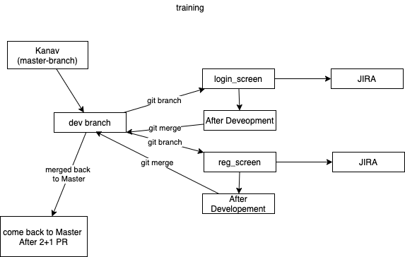
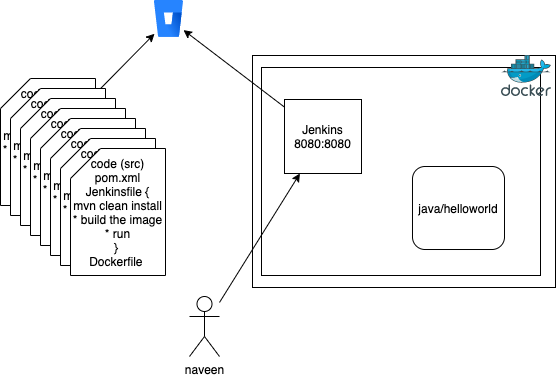
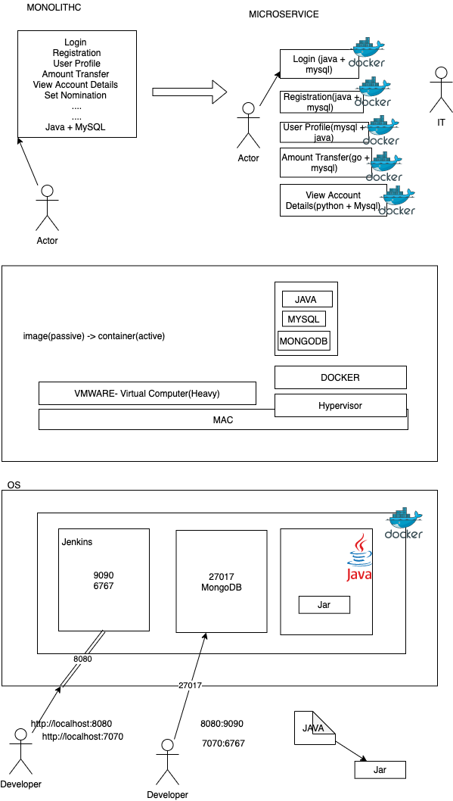
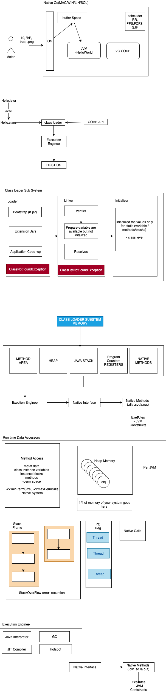

# Sapient Freshers-2021-jun-asde

Batch POC: Kanhav Ghai 
*** 

Aarsh Verdan - DTU, Joined in pJP, likes to play online games, guitar, and likes to learn technology 

Akhil tomar - DTU, likes : Backing Trecking, Travelling 

Akshit Kumar - IIT Karagpur, playing video games, graphic designing, PS, 

Aneesha Kota - IIT bhubaneshwar, play badminton, sports, singing 

Bitan - IIT Bhubanesh, sudoku, likes reading a lot, watching web series one 

Deepanjan  - IIT Patna, CS, like to sing, swimming 

Harshit singal - IIT Delhi, part of PJP, optimistic, likes to play soccer, and like playing chess 

Hemanth Umanshanar - NIT Suratkat, plygin video games, watigin movies, playing guitar 

Kanav Ghai - IIT Patna, likes youtube with sports, and likes eating 

Karmanya Sharma - likes to learn, play football, badminton, started blogging, 

Krishna - IIT Bhubaneshwar, CS, watching cricket, likes cooking 

Lakshya - IIT Gandhinagar, CS, playing badminton,  likes listening to music, 

Prateek - IIT Kharagpur, watining movies, does cooking 

Priyadarshan - DTU, CS, likes to play guitar, likes to play with dog, reads blogs 

Raj Shekar - does painting, drawing , and likes to watch TV Series 

Rizwan Khan - from Delhi, IIT Patna, playing cricket 

Rohit - IIT Gandhinagar, ply online games, cricket watch TV Series, 

Sailaja - IIT bhubaneshwar, plays badminton, mobile games 

sanjana - NITK surajkal, digital art work, 

Shushrut - NITK suratkal, CS, motor sport 

Sioddharth - IIT Roorkey, plays any sports, watch movies, TV series, etc 

pradyuman - IIT patna, plays chess, watch movies, in free time 

Suhas - IIT suratkal, PC games, watch F1, football

Veena - NITK suratkal, playing basket ball, likes eating street food. 


***


# DAY 1 
CONFLUENCE(Wiki) - JIRA - BITBUCKET 

Git +  GitHub / BitBucket  
Jenkins (CI/CD)

LEFT -> RIGHT ( collges, they teach technologys then solve the problem)
RIGHT -> LEFT (first identify the problem then the technology comes)


Work Approach
1. Tech stack 
2. 4-5 Week of training - in that we have a small project 
3. 7 Weeks a full fledged project work 
   
TDD Style - Technology 
BDD Style - Semi Technology
     GIVEN, WHEN, THEN (AND, BUT)
DDD Style - Pure Business 

DOR - Defination of Release  
DOD - Defination of Done 


## _Working Method_


List Of Softwares : 

* Git Bash : https://git-scm.com/downloads
* Java 8 : https://www.oracle.com/in/java/technologies/javase/javase-jdk8-downloads.html
* Jenkins : https://www.jenkins.io/download/
* Docker : https://docs.docker.com/docker-for-windows/install/
    
    > docker run hello-world 

* Eclipse : https://www.eclipse.org/downloads/
* VS Code : https://code.visualstudio.com/download
* NodeJS : https://nodejs.org/en/


Either go with "master", "main" 

### Git Commands 
> git init 

> git branch <branchName> -- create a branch 

> git checkout <branchName> - checkout / switch branch 

> git branch --merged  - to show if the current branch is merged from other branch 

> git branch --no-merged - to show if the current branch is not merged from other branch 

> git checkout main 

> git merge new_branch 

> git checkout -b dev1  (create and switch the branch)

### Git Reset 
* soft reset - will keep the file in stagin area but not commit 
* mixed reset (defult) - this will take the file to untracked area 
* hard reset - the content is also take off 

In any case if you want to get back your code, have the commit id and you can checkout from there 

> The git reset command is a complex and versatile tool for undoing changes. It has three primary forms of invocation. These forms correspond to command line arguments --soft, --mixed, --hard. 

> git stash temporarily shelves (or stashes) changes you've made to your working copy so you can work on something else, and then come back and re-apply them later on.


In Git we have 4 area 
1. Untracked files 
2. Tracked (add)
3. committed files (commit)
4. stash

### working with stash
> git stash save "message"

> git stash list 

> git stash pop - it applied and removes

> git stash apply stash@{<NUMBER>} - applies and doesnot remove 

> git stash drop stash@{<NUMBER>} - to remove the stash 

> git stash clear - to clear all the stash 

> git stash show stash@{<NUMBER>} - to show the stash 

> git shash show -p  stash@{<NUMBER>} - to show the actual code 

> git fetch + git merge = git pull 

to delete the branch on remote 
> git push origin --delete branch_name

> git push origin :branch_name


### Branching Stratergy 


# Jenkins 

1. Freestyle project 
   1. scripted fashion (.sh / .bat)
2. Pipe line project * 
   1. you can have groovy code  in Jenkins 
   2. You can have groovy code in "Jenkinsfile" on remote SCM 


```
pipeline {
    agent any

    stages {
        stage('Hello') {
            steps {
                echo 'Hello World'
            }
        }
        
    }
}

```


```
    pipeline {
    agent any

    tools {
        // Install the Maven version configured as "M3" and add it to the path.
        maven "M3"
    }

    stages {
        stage('Build') {
            steps {
                // Get some code from a GitHub repository
                git 'https://github.com/jglick/simple-maven-project-with-tests.git'

                // Run Maven on a Unix agent.
                sh "mvn -Dmaven.test.failure.ignore=true clean package"

                // To run Maven on a Windows agent, use
                // bat "mvn -Dmaven.test.failure.ignore=true clean package"
            }

            post {
                // If Maven was able to run the tests, even if some of the test
                // failed, record the test results and archive the jar file.
                success {
                    junit '**/target/surefire-reports/TEST-*.xml'
                    archiveArtifacts 'target/*.jar'
                }
            }
        }
    }
}

```


### Create Maven Project 

> mvn archetype:generate -DgroupId=com.mycompany.app -DartifactId=my-app -DarchetypeArtifactId=maven-archetype-quickstart -DarchetypeVersion=1.4 -DinteractiveMode=false


****


# DAY 2 

Run with PR from Master -> Dev -> branches 


1. Maven 

Maven has 3 Stages 
* clean (clean)
* work (various stages like compile, deploy, install, provided etc)
* report (site) - this will help you to generate the report 


> mvn compile

> mvn clean compile

> mvn package

> mvn clean package

> mvn test

> mvn clean test

> mvn site – to generate documentation

> mvn clean

> mvn eclipse:eclipse – compatible to eclipse

*** 
simple to program to show usage of slf4j 


1. Docker

> Tightly Couples Loosely Cohisive -> Highly Cohisive Loosely Coupled systems 

Docker allows tha orchestration with 
* Docker Swarm 
* Rancher 
* ECS 
* Kubernetees 
  
*** 
## Docker Introduction Commands 

> docker info 

> docker images - will get all the images which are in current system 

> docker pull image-name - will search for the image in hub.docker.com 

> docker ps - active containers which are running 

> docker ps -a [ - active containers which are running  + which are stopped]

> docker rm container-id [to remove the container which is stopped]

> docker rmi imageif [ to remove the images]

> docker system prune [ to remove images which are not in use ]

> docker stop container-id [to stop the container which is running ]

> docker start container-id [to start the container ]
Note: you cannot delete running container to do so first stop / force delete 

> docker pull mongo 

> docker run -name sapient-mongodb1 -d mongo 

to get into the mongo instance 

> docker exec -it [ containerid/name ] sh 

**to push image to hub.docker.com**

> Syntax: docker push username/imageid:tag
> Example: docker push adithnaveen/java-image:1

### _Hosting Jenkins With Docker_

> docker pull jenkins 

> docker run --name sapient-jenkins-instance -d -p 8080:8080 -p  50000:50000  jenkins:2.7.4

> docker logs [ container-id ] - to get the logs of the running container 

> docker inspect [container -id ] - to get the details of the container 

> docker history i-hello-world-3


To deploy a java application 

Steps 
```
    1. docker pull openjdk 
    2. mvn clean install 
    3. copy jar file to docker container 
    4. java -cp target/app-snapshot.jar com.mycompany.app.App
```

_**Docker can build images automatically by reading the instructions from a Dockerfile**_

to build image 
> docker image build -t i-hello-world-4 .


to run 
>  docker run i-hello-world-5:latest


Assignment Image 

To build a pipe line for using jenkins / docker 



## Docker Volumes 

> docker volume ls 

> docker volume create vol-name

> docker volume inspect vol-name 

start jenkins instance attached to volume(default)

> docker run --name jenkins-container-1 -v [ vol-name ]:/var/jenkins_home -p 8080:8080 jenkins:2.7.4 

start jenkins instance attached to volume - bind a folder 

> docker run --name jenkins-container-1 -v /users/naveenkumar/Desktop/folder-name:/var/jenkins_home -p 9000:8080 jenkins:2.7.4 

*** 



> Team 1 - Prateek, rajshekar, akshit, harshit

> Team 2 - Deepanjan, kanav, rizwan, praduman 

> Team 3 - karmanya, priyadarshan, aarsh verdhan, akhil 

> Team 4 - krishna, aneesha, bitan, sailaja 

> Team 5 - rohit, laksay, shushut, siddharth 

> Team 6 - sanjana, suhas, hemanth, veena 


****

# DAY 3 

****

* Docker Volumes 
* install sonar lint + object aid 
* understand java program 

```
    int main() {} - you have control 
    void main() {} - 0 
```


_HelloWorld.java_
```
package com.naveen; 

    public class HelloWorld {
        static void hi()  {}
        void bye()  {}
        int x=100; - heap  
        static int yy=100;
        boolean flag = true; 
        public static void main(String [] args) {
            int y; 
            HelloWorld h = new HelloWorld();
            h.bye();
            hi();
            System.out.println(h.x);
            System.out.println("hi);
        }
    }


```
> javac -d . HelloWorld.java  - syntax and semantic .class - compiler / JITC
> java com.naveen.HelloWorld hi[0] bye[1] cya[2] - interpreter 


### Diagram 



_stack calls_

```
version 1 
int main(){
    hi();
}

hi(){
    bye()
}
bye() {
    cya()
}
cya(){}    

```


```
version 1 
int main(){
    hi();
}

hi(){
    ....
}
```


String can hold - "10" , "true", .png 
.exe - mac / lin (does not work)
.so / a.out - win / max (does not work)
.dmg - win / lin 

> access specifiers 
1. public 
2. private 
3. protected 
4. default(package)


***
Folder Structure 
Training (Repo)
    aneesha-llid
        w1-d1-git-jenkins
        w1-d2-maven-docker
        w1-d3-java
        w1-d4-java-dp

    bitan-llid
    Participant 3
    ..
    Participant n
***


- Differnt UML diagrams (26) types of diagram 
  - class diagram 
  - use case diagram 
  - activity diagram 
  - sequence 
  - profile diagram 
  - flow chart 
  - data flow diagram 
  - component diagram 
  - objecet diagram 
  - state diagram 
  - context diagram 

* HLD - High Level Diagram 
  * use case diagram 
  * flow chart 
  * component diagram
  * context diagram 


* LLD - Low Level Diagram 
  * class diagram 
  * use case diagram 
  * flow chart 


plantuml (explore)
abstract class  "abstract class"
annotation      annotation
circle          circle
()              circle_short_form
class           class
diamond         diamond
<>              diamond_short_form
entity          entity
enum            enum
interface       interface


OOPS - anti pattern  
* compositon - has-a
  
  ```
    class Employee {
        private int empId; 
        private Name name;
        private double salary; 

    // getters / setters 
    }

    class Customer {
        private Name name; 
        private int custId;
        private double income; 
    }
    class Trainer {
        private int tId; 
        private Name name; 
        private double level;

    }

    class Name {
        private String firstName; 
        private String middleName; 
        private String lastName; 
    }


  ```


* aggregation 
* association -is-a (generalization - speciliazation)
  ```
    class Vehicle {} - generic class 
    class Car extends Vehicle {}  generic class  - specific class 
    class Maruti extends Car {} - specific class 
  ```


* S - Single-responsibility principle
* O - open close - should be open for extension, but closed for modification
* L - Functions that use pointers or references to base classes must
             be able to use objects of derived classes without knowing it

```
    
    interface Vehilcle {
        public void move();
    }
    class Car extends Vehicle {
        public void driveStreering() {}
         public void move(){} 
    }
    class TwoWheeler extends Vehilce {
        public void handle(){}
         public void move(){} 
    }

    class VehilcleBL {
      

        public static void show(Vehicle v) {
            v.move();
            if(v instanceof Car) {
                v.driveSteering();
            }else if(v instanceof TwoWheeler) {
                v.handle()
            }
        }

    }

    class App {
        public static void main(String [] args) {
            Vehicle v; 
            v = getMe("car");
            VehicleBL.show(v);        

            v = new getMe("twoWheeler");
           VehicleBL.show(v); 
        }
    }

```


in C 
```
    int main() {
        int *p; 
        p  = (int *) malloc(100); 
        ... your business logic 

        free(p); 
    }
```

* I -  Interface segregation principle: 
    "Many client-specific interfaces are better than one general-purpose interface" 
* D - Dependency Injection (DI)/ IOC 


*** 
* KISS 
* DRY 
* YAGNI 


### Vehicle management system 
Below are the asks 

* The company (XYZ) who manufacures chasis / nuts/ enginee etc 
* they have a problem to integrate various cars which they are catering 
* the want a unifed system where can build "nut/bolt" for differnet cars / two / trucks 
*  the code is exposed to the client but they have comeback saying its complicated to 
  understand what is available 
  Ex:  class Vehicle {} 
  class Car extends Vehicle{}
  class Maruti extends Car {}
  
    class Breeza extends Maruti {}
    class Swift extends Maruti{}
  
  class BMW extends Car {}
    class X1 extends BMW {}
    class X2 extends BMW {}

  class Volve extends Car{}
    class VSixty extends Volvo {}

X1 x1  = new X1(); 
x1.showNutBolt() (wrong)

* they want a common interface where they can see size / dimention / weight of nut/ bolts 
* they would like to have the data kept in matrix format 
  * maruti -> Breeza / Swift ...
  * BMW -> X1, X2...
  * Volvo - VSixty, CSixty ...


write 1 method which should show all the cars (nuts/bolts)


****
# DAY 4 

Convention 
> package - has to be in lower case & cannot be in default package 
    * com.company.something 
    * org.company.something 

> variable / methods - camelcase - start with lower case then every words first char is in upper chse 

  * empId, empName, debitSalary, creditSalary, getEmployeeSalaryFromDB() 
  
> class name - pascal casing 
  * start with upper case then every next work first char in upper case 
    Employee, EmployeeProcessor, EmployeeDAO, IEmployeeDAO 
> constants 
    * to be in upper case 
    * COMPANY_NAME, TAX 


class - contracting Abastract Class (only abstract, you can have concrete methods) 
    / Interface (100%, concrete methods but has to be default prefixed) 


Noun - Entity / Bean 
Employee - DB 

EmployeeDAO 


> access-specifer access-modifier returntype methodname(param)

>access-specifer  - public, private, protected, default 
> access-modifier - static, final, sychronized, abstract 
> void or type (int, flotat, Employee, Vehicle) 


****


