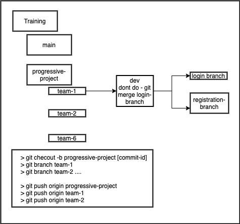

# Progressive Project Discussion 
https://www.draw.io/shortcuts.svg

> 23/jun/2021

> Team 1 - Prateek, rajshekar, akshit, harshit

    - created user stories 

    - create ER with draw.io 

    - yet to do multi module project 

> Team 2 - Deepanjan, kanav, rizwan, praduman 
    
    - create user stories 
    
    - tried with multi module project - will finalize today 
    
    - docerize postgress + mongodb 
> Team 3 - karmanya, priyadarshan, aarsh verdhan, akhil 
    
    - create user stories 
    
    - done with the ER - share the link 
    
    - not started with project strucutre
    
    - http://www.plantuml.com/plantuml/png/TP51JyCm38Nl-HLMJmEqILohQThOQKU4u88ucCHCqPfa9EucLFZl96rALtMSR7slzdDUru7HSsqg8IiC0Pu3-KR07BGgKx5eg6qEw0sstMTDWRMpeOJ7tBw-9G5jE9EFUDCs7PJE6B8SwRRh8luHGbic_u6IOBTrbYFV9OAIORc4GLsje15m1oUd5TJ7asEQtVm1vSxsPOmy7Ptd2AwQR9Iws8TAPJxB5MHNqtXEf5VQL0ngcq49J-ortITSwGE5CftztvCJzeHCwk6hR5CU7Bgue84sH2dfoAHAU7Uk8hJ3TttQq5n9EtGcZFlGNnP9FzjVqeqcV9d8ydkno6kcl7SLqn-Lv0o5I6-2uhu0Dvz3SLiCWnCbMqruFbA8l3GwH2NJ4SmhHcmmN9DLjQb-0G00

> Team 4 - krishna, aneesha, bitan, sailaja 
    
    - create user stories 
    
    - need to draw the ER 
    
    - have setup docker for postgres, monogdb 
    
    - yet to do multi module project 
> Team 5 - rohit, laksay, shushut, siddharth 
    
    - done with user stories 
    
    - started with ER 
    
    - have setup docker for postgres, monogdb 
    
> Team 6 - sanjana, suhas, hemanth, veena 
    
    - create user stories 
    
    - data model is ready with excel 
    
    - confused with what data will go where 
    
    - yet to setup multi module project 

### Data  in project 

> Registration System   
-  User - postgres 
-  Loggers - postgres 

> MongoDB 
-   Question 
-   Answers 
-   Comments 
-   UP / DOWN 
-   Follow User 

> 24-jun-2021

> Team 1 - Prateek, rajshekar, akshit, harshit

- created user stories 
- create ER with draw.io  (done)
- yet to do multi module project  (done)
- feature file is created 
- connected with mongodb 
- schema for postgres is done 
- still have to finalize data model 
- https://github.com/blankRSD/QAries/blob/prateek/databasesql/ER_team1_2.png

> Team 2 - Deepanjan, kanav, rizwan, praduman 
- create user stories (done)
- tried with multi module project - will finalize today (done)
- schema + ER is done 
- created data model for mongodb / nosql 
- bean classes are created for postgres 
- docerize postgress (done)+ mongodb (yet TODO)

> Team 3 - karmanya, priyadarshan, aarsh verdhan, akhil 
- create user stories - done 
- data model is created - done 
- done with the ER - share the link 
- not started with project strucutre
- have created class diagram 
- need sequence diagram 
- create multi module project 
- docerize postgress (done)+ mongodb  (done)
    

> Team 4 - krishna, aneesha, bitan, sailaja 
- create user stories - done 
- need to draw the ER - yet to do 
- sequence diagram - done 
- create schema for postgres, 
- data model for mongo - done 
- have setup docker for postgres(yes), monogdb  (Yet to be done)
- multi module project - done 

> Team 5 - rohit, laksay, shushut, siddharth 
- done with user stories 
- postgres  ER  - done 
- have setup docker for postgres, monogdb (not yet)
- multi module project - done
- data model  - done 
- class diagram + sequence diagram (yet tobe done)

> Team 6 - sanjana, suhas, hemanth, veena 
- create user stories 
- er diagram + schema - done 
- started development have done JPA code 
- data model is ready with excel 
- confused with what data will go where 
- yet to setup multi module project 
- class diagram - done 
- sequence diagram - yet to do 

## 25 Jun 2021 

Team1: 
- User registration done 
- services for BL 
- working on login 
- services for login is in process 
- some bugs to be resolved by team 
- need to seed the code to bit bucket 

Team2: 
- started with test cases 
- view and controllers are pending 
- BL is working ... 
  
Team3: 
- BL is in progress 
- DAO / Services are done 
- View to be done 
- user reg - services (done) - view in progress 
- sequence is done 
- junit(jupiter) in some order 

Team4: 
- CRUD - DAO Layer is done 
- working on controller 
- need to write test cases 

Team5: 
- dao layer is completed 
- working on controller 
- sequence, class  is done, 
- docerized the DB 
- view is in progress 

Team6: 
- DAO layer is in progress 
- need to write controller 
- sequence diagram is done 
- docerized the DB 

